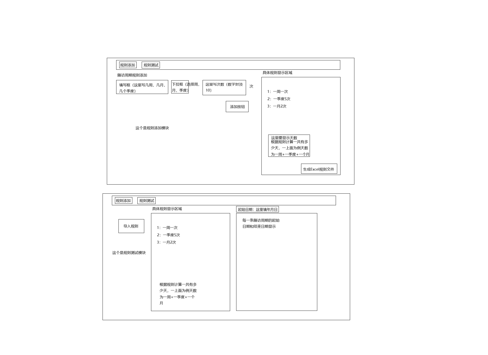
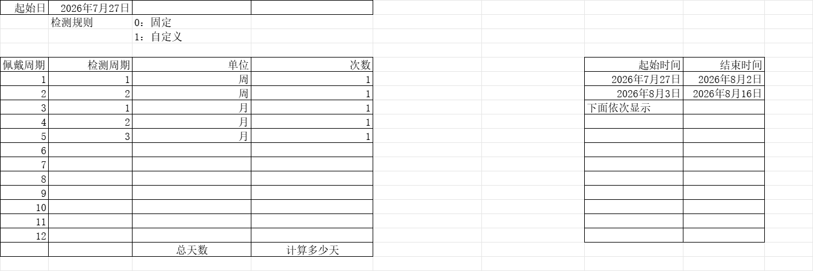

下图是我设计的一个粗略java程序打开之后的效果，你可以参考这个图片来设计，本java程序完成后需要打包一个mac端和一个windows端可以用来启动测试，规则添加是我们去使用的，规则测试的功能是给服务器调用的，最后需要一个jar包最后去给服务器在系统中点击导入规则按钮，选择完Excel文件之后，调用这个java程序的接口功能，得到文件中的规则数据，起始时间，结束时间等等数据

此程序需要对接项目文件夹中的pom.xml文件，此文件是服务器那边的java系统文件，不能修改

1、规则添加模块：

- 添加一条规则则在右边添加一条显示数据，每个随访周期规则就是一个随访周期个数

- 这个是点击生成的Excel规则文件，起始日期和结束日期在生成文件阶段不需要系统计算，只需要在Excel文件给出一个例子即可，起始时间为当天，结束时间根据佩戴周期规则计算，检测规则固定的意思是每个检测周期的规则都是一样的，比如哦都是一周一次则为固定规则，如果有一个不一致则为自定义规则，结束时间为7天后的前一天，总天数要根据规则计算有多少天，计算规则写在了图片中，随访周期个数就是佩戴周期的个数

- 规则测试模块是多写的一个在本地测试的功能，到时候实际上是把jar包传输给服务器之后，服务器那边来调用这里面的导入规则等等功能

- 点击导入规则之后选择Excel规则文件，解读里面的数据，最后显示出来的需要和添加规则显示区域里面的一致，读取文件之后返回的数据格式需要和写入时一致。

- 服务器输入佩戴起始日，就会得到个人佩戴日历，这里是测试一下功能是否正确，起始日期分年月日出现下拉框让人选择，全部选择完之后，调用功能函数或者接口会返回数据在后面显示区域显示每一个佩戴周期的起始时间和结束时间

  以上规则测试模块这些都有返回的固定数据让服务器调用，这个规则测试模块只是用来测试功能是否符合需求的而已

  

  整体设计：

  | 名称                | 说明           | 变量类型                               | 举例                                                         | 来源                        |
  | ------------------- | -------------- | -------------------------------------- | ------------------------------------------------------------ | --------------------------- |
  | WearMode            | 佩戴模式       | Integer                                | 0:固定日期  :1:窗口期任意日                                  | 医生输入                    |
  | WearType            | 佩戴类型       | Integer                                | 0:固定模式1:自定义模式（默认值）注：自定义模式下每个佩戴周期都为数组或者在java中是类中的一个元素（对象） | 建立课题时输入              |
  | surgeryDate         | 手术日期       | String（固定格式表示日期）             | “2025-06-11”提醒医生作用，与实际运算关系不大                 | 医生输入                    |
  | startWearingDate    | 佩戴起始日     | String（固定格式表示日期）             | “2025-06-11”参与整个运算                                     | 医生输入                    |
  | suggestWearingDate  | 建议佩戴日     | String（固定格式表示日期）             | "2025-06-11"提醒医生作用，与实际运算关系不大                 | 医生输入                    |
  | detectionPeriodNum  | 检测周期：数值 | Integer                                | 4                                                            | 由下面detectionTaskList算出 |
  | detectionPeriodUnit | 检测周期单位： | Integer                                | 0:天,1:周，2:月，3年                                         |                             |
  | detectionTaskList   | 检测任务列表   | 用java来写可以是列表可以是类可以是对象 |                                                              | 对这个列表进行详细说明      |
  
   
  
   
  
  detectionTaskList 详细说明
  
  | 名称                       | 说明             | 变量类型                   | 举例                                  | 来源                          |
  | -------------------------- | ---------------- | -------------------------- | ------------------------------------- | ----------------------------- |
  | taskName                   | 周期名称         | String                     | “第一周期”                            | 建立平台时，通过导入excel得出 |
  | startDate                  | 周期开始日期     | String（固定格式表示日期） | "2025-06-11"                          | 根据规则由JAR包得出           |
  | endDate                    | 周期结束日期     | String（固定格式表示日期） | "2025-06-18"                          | 根据规则由JAR包得出           |
  | taskNum                    | 任务编号排序     | Integer                    | 1                                     | 建立平台时，通过导入excel得出 |
  | wearingDate                | 佩戴日           | String                     | 暂定，先给NULL                        |                               |
  | overdueDays                | 超期天数         | Intege                     | 先默认0                               | 暂定                          |
  | status                     | 任务状态         | Integer                    | -1超期未佩戴，0未佩戴，1已佩戴先默认1 | 暂定                          |
  | detectionFrequencyNum      | 检测频率值       | Integer                    | 数值                                  | 建立平台时，通过导入excel得出 |
  | detectionFrequencyUnit     | 检测频率单位     | Integer                    | 0:天,1:周，2:月，3年                  |                               |
  | detectionFrequencyCount    | 检测频率次数     | Integer                    | 2值                                   |                               |
  | validDetectionDuration     | 有效检测时长     | Integer                    | 6                                     |                               |
  | validDetectionDurationUnit | 有效检测时长单位 | Integer                    | 0：分钟，1：小时                      |                               |
  
   
  
  Excel表中的起始时间和结束时间是例子显示，不是上面任何一个变量，自行创建变量，上方的起始时间需要在后面有人进行填写之后才计算使用起始日期和结束日期